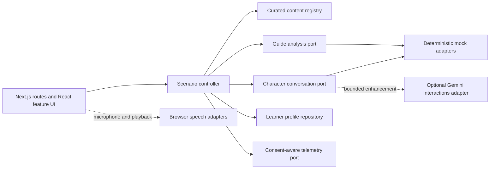

# MANARA | منارة — Technical Architecture

## Document status

This document defines the architecture for the MANARA competition prototype and first MVP. The application foundation, world → city → scenario travel slice, four deterministic dialogue packs, learner starting-point profile, scenario reducer, rule-driven evaluator, retry/history flow, Local Character/city Guide presentation, deterministic Fumble Map, optional Gemini conversation adapter, and browser speech adapters are implemented. Authentication, cloud persistence, production analytics, pronunciation scoring, and persistent realtime audio remain later contracts unless explicitly marked otherwise.

Related decisions about product scope and linguistic policy belong in [PRODUCT.md](./PRODUCT.md) and [LINGUISTIC_RULES.md](./LINGUISTIC_RULES.md). This document owns technical boundaries, data flow, state ownership, and quality gates.

## Architecture at a glance

MANARA is a mobile-first Next.js application delivered as a responsive web application / PWA, with deterministic conversations and a small, curated content set. Product features depend on provider-neutral ports. Deterministic adapters remain the guaranteed core; an optional server-side Gemini adapter can improve transient Local Character wording without owning evaluation or progression.

The recommended baseline is:

- Next.js with the App Router for routing, server/client boundaries, and future server endpoints.
- React and TypeScript with strict types.
- Tailwind CSS backed by semantic design tokens and CSS logical properties.
- Framer Motion confined to presentation and transition components.
- A lightweight installable shell using the App Router manifest, application icons, theme metadata, and standalone display mode.
- Pure domain modules for scenarios, dialect transfer, feedback policy, and learner patterns.
- Schema-validated, versioned content files with an explicit linguistic validation state.
- Deterministic mock AI providers as the default MVP runtime.
- No accounts, database, production analytics pipeline, or live AI dependency until each is justified.



Both dashed edges are optional enhancements. The deterministic path remains complete when either is absent or fails.

## Architectural principles

1. **Teach through cross-dialect transfer.** Domain concepts must retain the learner's likely source dialect, the target dialect, and the relationship between verified expressions. A generic correctness score is insufficient.
2. **Mock first, contract first.** The complete journey must work without credentials, network access, or a microphone. Live providers implement contracts already exercised by deterministic fixtures.
3. **Communication before correction.** The application layer, not a model prompt alone, owns whether and when feedback appears.
4. **Curated beats broad.** Published teaching claims reference reviewed content. Model output never silently becomes trusted curriculum.
5. **Separate AI roles.** The Local Character and MANARA Guide have different inputs, outputs, prompts, policies, and provider sessions.
6. **Privacy by minimization.** Raw audio and full transcripts are transient by default. Cross-dialect learning memory stores the smallest useful derived pattern.
7. **Accessible in both directions.** Arabic, English, RTL, LTR, keyboard access, reduced motion, and non-audio alternatives are architectural requirements.
8. **Delay infrastructure choices.** Add services, persistence, and deployment complexity only when a product requirement needs them.

## Runtime and rendering boundaries

Next.js server components should render stable route shells and read public, validated destination/scenario content. Client components should be limited to interaction-heavy islands: the world map, cinematic travel sequence, media controls, live conversation, feedback/retry, and session insights.

The browser owns presentation and transient interaction state. Any future code that uses provider credentials, creates short-lived Realtime credentials, or performs privileged provider calls must run behind a server-only boundary. Long-lived secrets must never be embedded in a client bundle.

The App Router is the current recommendation, not an irreversible product decision. Locale URL strategy, deployment host, and streaming transport should be decided during scaffolding or an integration spike.

The competition build includes PWA shell readiness: a web app manifest, install icons, theme/background metadata, standalone display mode, and safe-area-aware layout. This does not imply offline capability. Service workers, sophisticated cache invalidation, background synchronization, and custom install prompts remain deferred until a concrete requirement justifies their lifecycle and testing cost.

### Implemented world → city → scenario slice

The travel experience uses URL-backed composition so selection survives refreshes and deep links remain inspectable:

| Route | Responsibility |
| --- | --- |
| `/map` | Arab-world view, available and future destination nodes, destination detail, and world-to-city travel initiation |
| `/map/[destinationSlug]` | Validated city view, arrival context, and scenario-hotspot selection |
| `/map/[destinationSlug]/[scenarioSlug]` | Validated scenario arrival and the deterministic Local Character conversation, optional Guide moment, retry, and completion flow |
| `/fumble-map` | Browser-local, deterministic journey insights and traceable practice recommendations |

Only structurally valid, `available` scenario records can advance the explicitly labelled draft/review journey. This route availability is separate from linguistic publication eligibility: a reachable `needs_review` pack cannot power an authoritative Guide claim. Casablanca remains a non-enterable Coming Soon destination, and preview or coming-soon hotspots cannot be opened by guessing a URL.

The implementation keeps geographic rendering replaceable:

- Structured destination coordinates, camera presets, route geometry, arrival copy, future nodes, and scenario hotspots live in content/domain modules rather than a map component.
- Page composition combines scenario-bearing destinations and metadata-only future nodes into one typed world-network view model. Both MapLibre and the built-in fallback consume that same model; future records have no dialect, scenario, character, progress, or route fields.
- A provider-neutral map interface supplies the UI with camera, marker, route, and completion behavior.
- The current rich adapter is MapLibre GL JS 6.6 using OpenFreeMap's keyless Liberty vector style. It requires no map account, token, or map environment variable. World place/POI symbols are suppressed so MANARA's destination hierarchy remains dominant; city views retain provider streets, buildings, place labels, and contextual points of interest beneath the curated scenario landmarks.
- MapLibre 6's ESM worker and shared module are copied from the installed package into `public/maplibre/` by the `predev`, `prebuild`, and `prestart` scripts. The adapter calls `setWorkerUrl` before map construction. This is required for Next.js deployments: without it, raster terrain can appear while vector streets, buildings, GeoJSON overlays, and symbols silently remain unavailable.
- A deliberate built-in fallback renderer preserves the same destination and hotspot controls while MapLibre initializes and when WebGL, style loading, or required network resources fail. Readiness requires a loaded geographic style with the expected source; individual tile errors do not permanently discard a renderer that can continue loading. Map availability is visual enhancement, not a routing dependency. City hotspots use lightweight scenario-kind landmarks in both renderers so café, campus, transport, majlis, and market locations remain legible without a large icon library.
- MapLibre world nodes and city hotspots use semantic DOM markers anchored to geographic coordinates above the provider canvas. The fallback uses the same structured nodes. A shared priority/bounding-box resolver controls label visibility, guarantees a selected label receives a viable edge-aware anchor, and derives centered non-overlapping hit diameters for dense regions; markers remain present when a lower-priority label is hidden.
- The world view overlays a local Natural Earth 1:50m Admin 0 extract for the 22 Arab League member states. MapLibre consumes the compact geographic GeoJSON while the network-independent fallback consumes the matching pre-projected SVG. After style or source-data updates, the adapter explicitly raises the country fill, route, border glow, and border layers in that order; semantic city markers remain DOM controls above the canvas. The extract is presentation data only: city markers remain the selection target, and the overlay does not imply hard linguistic boundaries.
- Camera and transition orchestration uses explicit operations with cancellation/stale-completion protection. Skip, timeout recovery, teardown, and reduced-motion paths settle the same application transition exactly once.
- Scenario feature UI owns presentation of the setting, Local Character, objective, microphone/text/practice controls, selective Guide surface, retry, and completion. Pure application modules own evaluation and state transitions. The UI calls a provider-neutral client facade; only the server route imports the Gemini SDK.

MapLibre types and SDK objects remain inside the adapter boundary. Route decisions, availability rules, and travel state do not depend on MapLibre or OpenFreeMap, which allows a different renderer to implement the same interface later without changing domain data or route composition.

The provider swap was verified on 2026-08-30 against MapLibre's official [installation](https://maplibre.org/maplibre-gl-js/docs/), [Mapbox migration](https://maplibre.org/maplibre-gl-js/docs/guides/mapbox-migration-guide/), [v6 ESM migration](https://maplibre.org/maplibre-gl-js/docs/guides/v5-to-v6-migration-guide/), and [WebGL support](https://maplibre.org/maplibre-gl-js/docs/examples/check-if-webgl-is-supported/) guidance, plus OpenFreeMap's official [quick start](https://openfreemap.org/quick_start/) and [attribution guidance](https://openfreemap.org/). Liberty was selected from OpenFreeMap's supported style endpoints after production inspection: unlike the very low-contrast Dark style, it keeps regional geography and city streets readable inside MANARA's existing dark chrome, while adapter-level label suppression leaves the curated MANARA markers dominant. The built-in attribution control reads the style-source attribution and remains visible.

## Module boundaries

### App composition

Owns routes, layouts, metadata, locale/direction setup, error boundaries, and composition of feature entry points. It contains no dialect rules and no provider-specific conversation logic.

### Domain

Owns framework-independent types and pure policies:

- destinations, dialects, scenarios, characters, and turns;
- cross-dialect expression relationships;
- feedback classifications and prioritization;
- session state transitions;
- learner-pattern derivation;
- consent and retention decisions;
- linguistic publication eligibility.

Domain code must not import React, Next.js, browser APIs, Tailwind, Framer Motion, or provider SDKs.

### Content

Owns the small curated registry for destinations, dialogue packs and beats, character/environment fixtures, draft or verified expressions, cross-dialect mappings, citations/reviewer metadata, and deterministic conversation fixtures. It validates shape but does not pretend that schema validation proves linguistic accuracy.

`needs_review` content may remain in the repository for editorial work, but publication selectors must exclude it from authoritative teaching claims. The precise editorial standard belongs in `LINGUISTIC_RULES.md`.

### Application / scenario orchestration

Owns use cases such as starting a scenario, accepting a learner turn, coordinating the Local Character and Guide, deciding whether to surface feedback, handling a retry, completing a scenario, and deriving insights. It speaks only in domain types and provider ports.

The implemented scenario controller is a reducer/state machine with explicit preparing, ready, listening, processing, character-response, feedback, retry, completion, cancellation, and recoverable-error transitions. This keeps staged mock timing deterministic now and makes future asynchronous audio, transcripts, cancellation, and stale events testable without rewriting the UI.

### Implemented deterministic learning core

- Four six-beat dialogue packs are keyed by stable scenario, beat, line, response, vocabulary, character, and environment IDs: Abu Dhabi café, Abu Dhabi university, Cairo café, and Cairo taxi.
- Each Arabic-bearing content record inherits versioned review metadata. The currently authored packs are `needs_review` and disabled for authoritative publication; they remain available only in the visibly disclosed internal deterministic review path.
- The evaluator normalizes bounded Arabic input, matches only scenario-eligible records, and implements target-natural, cross-dialect, MSA/register, and uncertainty outcomes. A target alternative or dialect attribution is publishable only when every referenced variant/rule is `verified`, enabled, versioned, evidenced, reviewer-attributed, and dated.
- Learner starting points derive support without changing route access: beginner, MSA learner, dialect learner with an optional known variety, and heritage/partial learner.
- Visiting a destination is travel state, not evidence of language knowledge. Transfer context is derived from the configured starting point and known-concept/history records.
- The Local Character remains in-world. The Guide receives the post-turn evaluation and may show at most one policy-eligible point; draft content produces review-pending/uncertainty handling instead of an authoritative teaching claim.
- Provider ports remain intact for replacement adapters. The current learning loop may request a Gemini enhancement but never requires credentials, audio, authentication, or a database. Provider failure is an expected branch into the same deterministic turn.
- Typed and recognized speech first attempt a unique match against the current beat's small authored option set. Exact wording is not required when the meaningful authored words identify one option unambiguously. Ambiguous or unrelated input never guesses an intent and receives a distinct deterministic in-character clarification if Gemini is unavailable.

### AI and speech ports

Own provider-neutral contracts and normalized events. Provider SDK types must end at the adapter boundary.

- `CharacterConversationPort`: retains the deterministic scripted contract used by the complete offline-capable journey.
- `ConversationProvider`: accepts a bounded transcript, role context, current beat, allowed intent IDs, and planned deterministic continuation; returns a schema-validated `GeneratedCharacterTurn` or normalized availability/failure.
- `GuideAnalysisPort`: evaluates a completed learner turn against a target, learner context, and eligible verified references, returning structured analysis rather than rendered prose.
- `SpeechRecognitionPort`: wraps browser microphone permission, Arabic recognition, silence, cancellation, timeout, and device errors independently of Gemini.
- `SpeechPlaybackPort`: plays human-recorded audio when supplied, otherwise attempts browser speech synthesis, selects the closest installed regional Arabic voice with a character-gender preference, resolves on actual playback completion, and exposes cancellation.

The deterministic implementations are production-quality fallback adapters, not temporary UI conditionals. `GeminiConversationProvider` uses the server-only `@google/genai` SDK and GA Interactions API with `gemini-3.5-flash`, structured JSON output, `store: false`, a seven-second provider deadline, cancellation, and normalized quota/network errors. The browser deadline is deliberately slightly longer so it does not abort a still-valid server request first. Generated output is always stamped `needs_review`; a probable intent can map to progression only through one matching human-verified response option. Verified fixed dialogue always wins. The Guide consumes only MANARA evaluation output and remains a separate city-specific human companion, never a Gemini chat surface.

Browser speech recognition was selected instead of a persistent Gemini Live session for the competition path. It keeps the permanent API key server-side, avoids a long-lived raw-PCM/WebSocket lifecycle, and degrades immediately to typed or scripted input. A learner-requested stop submits an available interim transcript immediately and uses a bounded settle only when the browser has not produced text, preventing browsers that omit `end` from leaving the UI in processing. Known authored intents progress without waiting on optional Gemini enhancement. Google documents ephemeral Live API tokens as Preview; Live remains a future replaceable adapter if its reliability and credential lifecycle become appropriate.

### Gemini decision record (consulted 2026-08-29)

The current official sources were [Interactions API overview](https://ai.google.dev/gemini-api/docs/interactions-overview), [JavaScript SDK setup](https://ai.google.dev/gemini-api/docs/get-started), [model catalogue](https://ai.google.dev/gemini-api/docs/models), [pricing/free tier](https://ai.google.dev/gemini-api/docs/pricing), [API-key security](https://ai.google.dev/gemini-api/docs/api-key), [structured output](https://ai.google.dev/gemini-api/docs/structured-output), [rate limits](https://ai.google.dev/gemini-api/docs/rate-limits), [troubleshooting](https://ai.google.dev/gemini-api/docs/troubleshooting), [Live WebSocket setup](https://ai.google.dev/gemini-api/docs/live-api/get-started-websocket), [ephemeral tokens](https://ai.google.dev/gemini-api/docs/live-api/ephemeral-tokens), [Live session lifecycle](https://ai.google.dev/gemini-api/docs/live-api/best-practices), [transcription](https://ai.google.dev/gemini-api/docs/transcribe), [audio understanding](https://ai.google.dev/gemini-api/docs/audio), and [speech generation](https://ai.google.dev/gemini-api/docs/speech-generation).

The Interactions API is Google's recommended API for new agentic applications and is GA. The stable `gemini-3.5-flash` model was selected for short, latency-sensitive conversation enhancement and is listed with free-tier access at consultation time. Free-tier availability and limits are third-party conditions, not MANARA guarantees; 429/quota exhaustion is treated as normal fallback. The permanent `GEMINI_API_KEY` exists only in `.env.local`/the server environment and is read only by the Node.js route handler. No `NEXT_PUBLIC_` Gemini secret, browser SDK import, HTML embedding, storage, or error rendering is permitted.

### Feature UI

Owns cohesive user capabilities such as travel, scenario conversation, Guide feedback/retry, and learner insights. Each feature receives typed view models and calls application actions; it does not read another feature's internals or call AI adapters directly.

### Shared UI and presentation

Owns semantic primitives, bilingual typography, focus behavior, feedback cards, media controls, motion primitives, and visual tokens. Motion components receive state and emit completion/cancel events; they do not own scenario progression.

### Persistence, privacy, and observability adapters

Own replaceable implementations of learner-profile storage, consent storage, operational logging, and product telemetry. The default telemetry adapter can be no-op. Consent must be enforced in the adapter and event construction layers, not only by hiding a settings control.

### Dependency rules

- Domain depends on nothing outside its own schemas and pure utilities.
- Content depends on domain schemas, never on UI.
- Application code depends on domain and port interfaces.
- Adapters implement ports and may depend on browser APIs, storage, Next.js server facilities, or a provider SDK.
- Features depend on application facades and shared UI, never on concrete providers.
- Cross-feature communication uses application actions or domain events, not deep imports.
- Server-only adapters must be mechanically separated from client-importable modules once tooling is configured.

## Suggested repository layout

This layout describes the intended module boundaries. The implemented foundation uses the relevant subset and should add folders only as later phases need them:

```text
src/
  app/                         # Next.js layouts, routes, and error boundaries
  features/
    travel/                    # Map selection and cinematic transition UI
    scenario/                  # Conversation surface and controls
    feedback/                  # Guide intervention and retry UI
    insights/                  # Session summary / Fumble Map UI
  domain/
    content/                   # Content and validation types
    learning/                  # Classification, transfer, and learner patterns
    scenario/                  # Session, turn, and state-machine types
    privacy/                   # Consent and retention policy types
  application/
    scenario/                  # Scenario controller and use cases
    feedback/                  # Selective-feedback policy
    insights/                  # Derived insight use cases
  content/
    destinations/              # Curated destination definitions
    scenarios/                 # Curated scenario beats and fixtures
    linguistic/                # Reviewed expressions and transfer mappings
    registry/                  # Schema validation and publication selectors
  ai/
    ports/                     # Character and Guide contracts
    providers/
      mock/                    # Deterministic prototype provider
      openai-realtime/         # Future adapter; absent until integration work
  media/
    ports/                     # Capture and playback contracts
    browser/                   # Browser media adapters
  state/                       # App/session composition and repositories
  components/                  # Shared accessible UI primitives
  lib/
    observability/             # Redacted logs and consent-aware events
    security/                  # Input/output validation helpers
  styles/                      # Tokens, fonts, and global direction rules
public/                        # Reviewed static images/audio where appropriate
tests/
  contracts/                   # Shared adapter contract suites
  fixtures/                    # Deterministic non-sensitive test data
docs/                          # Product, architecture, linguistic, and build plans
```

If the codebase remains small, folders should be combined rather than populated with one-file abstractions. The dependency directions matter more than the number of directories.

## Core domain model

The following TypeScript is illustrative contract design, not application scaffolding:

```ts
type DestinationId = string;
type ScenarioId = string;
type SessionId = string;
type TurnId = string;
type ContentId = string;

type Locale = "ar" | "en";
type DialectId = "egyptian-cairo" | "emirati-abu-dhabi" | string;
type ValidationState = "verified" | "needs_review";

interface LinguisticProvenance {
  validationState: ValidationState;
  origin: "curated" | "model_generated";
  reviewerIds?: string[];
  reviewedAt?: string;
  sourceNotes?: string[];
}

interface LocalizedLinguisticText {
  id: ContentId;
  text: string;
  locale: Locale;
  dialectId?: DialectId;
  provenance: LinguisticProvenance;
}

interface Destination {
  id: DestinationId;
  name: Record<Locale, string>;
  dialectId: DialectId;
  availability: "available" | "coming_soon";
  scenarioIds: ScenarioId[];
}

interface ScenarioDefinition {
  id: ScenarioId;
  destinationId: DestinationId;
  targetDialectId: DialectId;
  characterId: string;
  level: "beginner" | "intermediate" | "advanced";
  goals: string[];
  allowedReferenceIds: ContentId[];
  fixtureId: string;
}

type FeedbackCategory =
  | "natural_target_usage"
  | "cross_dialect_transfer"
  | "msa_or_excessive_formality"
  | "correct_but_locally_unnatural"
  | "vocabulary_error"
  | "grammar_error"
  | "unclear_meaning"
  | "pronunciation_issue";

interface LearnerTurn {
  id: TurnId;
  sessionId: SessionId;
  inputMode: "text" | "audio";
  transcript: string;
  transcriptConfidence?: number;
  startedAt: string;
  completedAt: string;
}

interface TurnAnalysis {
  turnId: TurnId;
  category: FeedbackCategory;
  confidence: number;
  communicationImpact: "none" | "low" | "high";
  localNaturalnessImpact: "none" | "low" | "high";
  likelySourceDialectId?: DialectId;
  verifiedReferenceIds: ContentId[];
  uncertaintyReason?: string;
}

interface FeedbackDecision {
  outcome: "skip" | "offer" | "request_clarification";
  primaryAnalysis?: TurnAnalysis;
  retryRecommended: boolean;
  reasonCode: string;
}

interface LearnerPattern {
  category: FeedbackCategory;
  sourceDialectId?: DialectId;
  targetDialectId: DialectId;
  verifiedReferenceIds: ContentId[];
  occurrenceCount: number;
  status: "observed" | "practising" | "resolved";
}

interface ConsentSettings {
  schemaVersion: number;
  persistProgressOnDevice: boolean;
  optionalProductAnalytics: boolean;
  optionalResearchContribution: boolean;
  decidedAt: string;
}
```

Production types should use runtime schemas at all external boundaries. In particular, model responses, stored state, route parameters, content files, and server endpoint payloads are untrusted until parsed.

### Model invariants

- Every Arabic teaching example and dialect attribution carries provenance and a validation state.
- A verified Guide claim can cite only `verified` references appropriate to the active target dialect and context.
- A `model_generated` item defaults to `needs_review`; it cannot be promoted automatically.
- A cross-dialect pattern contains both source and target dialects when the source is known.
- `pronunciation_issue` analysis remains disabled until the separate gates in `LINGUISTIC_RULES.md` pass.
- Coming-soon destinations cannot start a scenario even if a route is guessed.
- Async events include session and turn identifiers; the controller discards events for a stale or cancelled turn.

## Scenario state and data flow

### Session state machine

A scenario should move through explicit states similar to:

```text
idle -> preparing -> ready -> listening/typing -> processing
     -> character_responding -> ready
     -> feedback_offered -> retrying -> character_responding -> ready
     -> completing -> completed

Any active state -> recoverable_error -> prior safe state
Any active state -> cancelled
```

This model is implemented as a pure reducer. Presentation timing dispatches events into it; illegal and stale transitions do not advance the session. A retry is linked to the evaluated turn, has one attempt per issue, and resumes the active character context.

### One normal learner turn

1. The route resolves a structurally valid, available scenario from the content registry. The application creates a session with a snapshot of scenario version, target dialect, character configuration, and the eligible verified-reference subset, which is empty in the current review build.
2. The learner chooses microphone, **Type instead**, or a scene-safe practice response. Browser speech recognition supplies an Arabic transcript when available; MANARA does not receive or retain a raw audio buffer.
3. The deterministic evaluator runs first and writes the privacy-minimized `LearningEvent`. It owns meaning, intervention, retry, progression evidence, and all Fumble Map inputs.
4. For typed or recognized speech, the application first resolves an unambiguous authored response from the current beat. The browser may also send one bounded transcript and scene context to `/api/conversation`. The server calls Gemini only when `GEMINI_API_KEY` is configured. An operation ID and abort signal reject duplicate or stale work. If the provider is unavailable and no authored intent can be resolved, the Local Character gives a short deterministic clarification instead of replaying an indistinguishable line or remaining silent.
5. The application validates the schema, allowlisted probable intent, confidence, and review state. Model output is always `needs_review`; malformed, slow, unavailable, quota-limited, unsafe, or stale output is discarded.
6. A short valid generated line may temporarily play through the existing Local Character. It cannot replace a verified fixed line. Non-exact intent may advance only through one matching human-verified deterministic response option.
7. The Local Character response finishes before any feedback. The deterministic policy chooses `skip`, `offer`, or `request_clarification`; a city-specific human Local Guide may render at most one safe point.
8. A retry is an explicit learner choice unless meaning was too unclear to continue. It remains linked to the evaluated turn and resumes the same character context.
9. Only application-derived, policy-eligible structured events update insights. Gemini responses and raw utterances never enter the durable learner profile or Fumble Map.

### Selective-feedback policy

Feedback is appropriate when a candidate:

- changes or obscures meaning;
- blocks the character from responding naturally;
- strongly affects target-dialect naturalness;
- is a defensible cross-dialect transfer supported by a verified mapping; or
- repeats a previously observed learner pattern.

The policy should also apply a cooldown, avoid repeating the same explanation, prefer one useful intervention over a list of corrections, and suppress low-confidence classifications. If dialect attribution is not defensible, the only permitted classification copy is an uncertainty statement such as: “MANARA isn't confident enough to classify this expression.” Exact display copy remains content-owned and must be reviewed.

The mock provider should include fixtures for feedback offered, feedback skipped, ambiguous attribution, a retry, device failure, and provider failure. Fixture timing may simulate partial events and latency, but deterministic seed/state must keep tests repeatable.

## AI role separation

### Local Character

- Receives scenario setting, character persona, learner level, target dialect constraints, recent conversational turns, and the current learner utterance.
- Produces in-world conversational events only.
- Does not grade, expose classifications, explain grammar, update the learner profile, or choose whether the Guide interrupts.
- Has no tools and no access to research/analytics data.

### MANARA Guide

- Receives the completed learner turn, target dialect/context, a minimal derived learner-pattern summary, and an allowlist of eligible verified reference IDs.
- Produces structured analysis with category, confidence, impact, evidence/reference IDs, and retry recommendation.
- Does not play the scenario character, continue the conversation, or directly persist a learner pattern.
- Cannot assert a dialect mapping that is absent from verified references. Low-confidence results become uncertainty or no intervention.

### Application policy

Neither AI role controls product flow. The deterministic application layer validates both outputs, decides whether to show Guide feedback, renders approved teaching copy, applies retention rules, and owns retries. Prompts are defense in depth, not the sole enforcement mechanism.

The two roles should use separate provider sessions/configurations and separately versioned prompt/config assets. Their traces and errors must remain distinguishable without logging learner content.

## State ownership and persistence

| State | Owner | MVP lifetime | Notes |
| --- | --- | --- | --- |
| Destination/scenario selection | URL plus route composition | Navigation | Deep-linkable IDs; validated against the published registry. |
| Available destination/scenario data plus draft and verified linguistic content | Content registry | Build/deploy version | Immutable during a session; authoritative selectors expose only eligible verified linguistic references. |
| Scenario phase, turns, retries, queued feedback | Scenario controller | Current scenario | Reducer/state machine is the single writer. |
| Raw typed/scripted learner input and normalized input | Scenario session | Current browser session | Available to the active interaction only; excluded from durable profile serialization. |
| Audio buffers and playback handles | Media/provider adapter | Current media operation | Never copied into global state or persisted by default. |
| Animation progress | Owning presentation component | Current transition | Motion completion dispatches an application event. |
| Starting point, support preferences, known concepts, and derived learning events | Versioned learner profile repository | Session; optionally across visits | Browser-local only. Durable events omit raw learner text/audio and preserve category, concept, target/source IDs where supported, retry outcome, validation state, and timestamps. |
| Consent and accessibility preferences | Dedicated local preference repository | Across visits | Versioned and independently revocable. |
| Provider connection/session | Provider adapter | Current scenario | Exposes normalized status, not SDK objects. |
| Operational/product events | Observability adapter | Event-specific | Content-free and consent-gated as described below. |

The browser starts from a versioned unconfigured local prototype profile and migrates the earlier schema defensively. The learner may opt into on-device persistence; opting out clears both current and legacy stored profiles. Raw input is never serialized into the durable profile. Same-session learning history survives travel/navigation through the application state boundary, while cross-refresh continuity is controlled only by the repository. No global state library is required.

## Deterministic Fumble Map pipeline

The Fumble Map keeps five boundaries explicit:

1. **Learning-event storage:** the existing learner-profile repository persists only structured scenario completion, evaluated-turn, feedback, and retry events. Raw learner input and audio remain excluded.
2. **Pattern derivation:** a pure function groups events by communicative concept and target variety. Missing origin is normalized to `likelySourceDialectId: null` and `sourceDialectConfidence: UNKNOWN`; origin never participates in core success, difficulty, or recommendation eligibility.
3. **Insight generation:** verified evaluated turns may produce local-adaptation, vocabulary, repeated-difficulty, adaptation-strength, communication-strength, register, and cross-dialect insights. One relevant event is normally an `OBSERVATION`; two distinct relevant turns can form a `PERSISTENT_PATTERN`; repeated successful performance or a successful retry followed by later natural reuse can form a `STRENGTH`. Scenario completion may produce non-linguistic beginner progress without asserting a dialect fact.
4. **Recommendation generation:** learner starting point orders eligible recommendations. Every recommendation retains an `insightId` and the exact supporting learning-event IDs, then resolves an existing scenario hotspot for practice.
5. **Presentation:** the client route loads the same local profile as the scenario feature and renders the resulting view model. React components do not derive patterns or call an AI/provider adapter.

Source-dialect enrichment is deliberately stricter than local adaptation. A learner-facing `CROSS_DIALECT_PATTERN` requires at least two consistent, `verified`, `HIGH`-confidence events for the same source and target context. `LOW`, `MEDIUM`, `UNKNOWN`, conflicting, absent, or review-pending origin evidence produces no source claim. This nullable state may remain unknown indefinitely without blocking any other insight.

Current curated dialogue content remains `needs_review`, so it cannot produce authoritative named linguistic patterns. The prototype can still show honest journey progress from scenario completion; verified synthetic fixtures exercise the later linguistic path in tests. The empty state emits no score, percentage, chart, or invented strength.

## Linguistic validation gates

Technical validation supports, but cannot replace, review by qualified dialect speakers.

### Static content gate

1. Parse content against runtime schemas, including validation state and provenance.
2. Check referential integrity: destinations, scenarios, characters, and transfer mappings reference existing compatible IDs.
3. Check mechanical Arabic quality such as empty text, unintended control characters, and direction/locale metadata.
4. Require the human review process defined in `LINGUISTIC_RULES.md` before state changes to `verified`.
5. Build the learner-facing registry from eligible verified content only. `needs_review` entries remain editorially visible but cannot power authoritative feedback.

### Dynamic output gate

- Parse model analysis as a closed structured schema; reject unknown categories and malformed IDs.
- Resolve every claimed example/mapping through the verified content allowlist for that scenario.
- Treat generated Arabic or dialect attribution as `needs_review` unless it is a rendering of a verified referenced item.
- Enforce category-specific confidence thresholds outside the prompt.
- When evidence or confidence is insufficient, suppress the claim or render the reviewed uncertainty fallback.
- Never write generated output back into the curated registry or mark it verified automatically.

### Release gate

All four golden scenario packs must receive qualified human linguistic review within their declared locality, relationship, register, and speaker/addressee bounds. The café review must additionally cover natural target usage, Egyptian-to-Emirati transfer, MSA/formality, unclear meaning, and cases where MANARA must decline to classify. The review queue and record IDs are in [LINGUISTIC_REVIEW.md](./LINGUISTIC_REVIEW.md). Pronunciation claims are out of scope. At the current checkpoint the authoritative manifest intentionally contains zero linguistic records because every newly authored item remains `needs_review`.

## Localization, appearance, and immersive presentation

MANARA uses one component tree for both interface languages. `src/i18n/messages.ts` is the typed English/Arabic UI catalog, including route-critical key groups and locale-aware interpolation/plural helpers. `UiPreferencesProvider` is mounted above the route shell so changing language or appearance updates the document without remounting a scenario. Localized content fields remain structured objects and are selected at the presentation boundary; conversation lines and speech locales stay Arabic regardless of interface language.

The first visit derives the UI locale from the browser, then stores only an explicit `ar`/`en` choice and `system`/`light`/`dark` appearance in the versioned `manara:ui-preferences:v1` record. This repository is deliberately separate from learner-profile and travel-memory storage. A small pre-interactive initializer applies `lang`, `dir`, `data-appearance`, `data-theme`, `color-scheme`, and theme metadata before hydration where practical; the provider then owns system-theme changes and persistence recovery.

The visual system is driven by semantic CSS variables rather than component-specific light/dark palettes. Tokens cover page and elevated surfaces, translucent immersive chrome, primary/secondary/muted text, borders, accent states, success/warning/error, overlays, focus treatment, and depth. Light mode uses warm editorial neutrals; dark mode uses deep atmospheric surfaces. Appearance changes affect application chrome, captions, controls, sheets, Guide surfaces, and Fumble Map—not the authored lighting of scenario artwork.

RTL is structural rather than a blanket visual mirror. Layout uses logical properties and direction-aware navigation affordances; Arabic and English regions carry explicit language/direction metadata, while learner input uses automatic direction. Geographic coordinates, chronological progress, and physically meaningful scene composition remain stable. The few composition coordinates that must adapt are declared in the scene stylesheet, and reduced-motion paths keep every transition functional.

The scenario renderer preserves the explicit 2.5D stack: background, midground, character, foreground, ambient, UI, and temporary Guide. Presentation metadata controls crop and depth per scenario. Restrained filters, grounding shadows, atmospheric overlays, and independent low-amplitude motion integrate character cutouts without flattening the environment or moving progression into animation code. The Local Character remains the person in the scene; Reem in Abu Dhabi and Karim in Cairo are visually distinct, city-specific human companion personas that enter briefly in the Guide layer and never appear as AI/system branding.

Static delivery favors optimized WebP derivatives; unreferenced source artwork lives under `assets/source-art/` for traceability instead of being shipped from `public/`. Scenario plates were retained and recompressed because their compositions support the layer system. The four Local Character sources were retained only as controlled temporary inputs, recompressed, toned, and grounded; their remaining glossy/generative qualities make human-directed replacement a release-art priority. Guide portraits use a restrained editorial illustration direction to avoid studio-avatar styling, but they also remain replaceable presentation assets and do not imply that their linguistic guidance has been human-verified. Any replacement must keep stable content IDs and presentation contracts, document provenance/rights, and receive cultural review rather than expanding into a bulk image-generation loop.

## RTL, bilingual UI, and accessibility

- Mark Arabic spans and controls with `lang="ar"` and `dir="rtl"`; mark English with `lang="en"` and `dir="ltr"`. Use `dir="auto"` for unknown learner-entered text.
- Set direction at the smallest coherent region for mixed-language screens. Do not reverse geographic coordinates or chronological playback merely because surrounding text is RTL.
- Use CSS logical properties and direction-aware icons. Avoid hard-coded left/right spacing in feature code.
- Define Arabic and Latin font stacks with tested weight, diacritic, numeral, and line-height behavior. Do not rely on a Latin fallback for Arabic.
- Every map node must be a semantic, keyboard-operable control with a clear destination name and availability. Provide an equivalent destination list because a visual map cannot be the only navigation mechanism.
- Conversation audio must have visible play/pause/stop state and a transcript/text path. Microphone denial must preserve a text-input path.
- Announce final transcripts, important status changes, and Guide feedback with restrained live regions; partial transcripts should not flood screen readers.
- Travel sequences need skip controls and must respect `prefers-reduced-motion`. Essential state changes cannot depend on animation completion alone.
- Preserve focus through travel, feedback, retry, modal, and error transitions. Restored focus must land on the next meaningful action.
- Target WCAG 2.2 AA contrast, keyboard, name/role/value, zoom/reflow, and touch-target expectations. Test Arabic and English layouts at narrow and wide viewports.

## Privacy and consent

Functional learning memory, optional product analytics, and optional research contribution are three distinct purposes and must not share one bundled consent flag.

- The current browser-recognition adapter does not place raw audio in MANARA application state. Any future capture adapter may keep audio only for its active turn and must discard it on completion or cancellation.
- Keep full transcripts session-local by default. Durable progress uses derived categories, verified content IDs, source/target dialects, counts, and resolution state rather than verbatim speech.
- Browser speech recognition may transmit microphone audio to a browser/operating-system speech service under that vendor's policy. MANARA receives only the resulting transient transcript. This limitation must be disclosed and the typed fallback must remain equivalent.
- When Gemini is configured, the bounded transcript, current scenario/beat IDs, character role, learner starting-point category, allowed intent IDs, and planned continuation are sent transiently to Google. The provider request sets `store: false`; the application does not log or persist the request or generated response.
- Allow the core scenario to work when optional analytics and research are declined.
- Explain on-device progress memory separately and permit clearing it. Same-session transfer works even when across-visit memory is off.
- Record consent schema version and decision time; support withdrawal without retaining new events after the change.
- Research contribution must be explicit opt-in. Aggregation and de-identification are later pipeline responsibilities; do not call records anonymous while linkability or re-identification remains plausible.
- Product/operational events must exclude audio, transcripts, names, free text, prompts, and model responses.
- A future privacy review must define retention, deletion, residency, subprocessors, age handling, and legal basis before production collection.

## Security boundaries

- `GEMINI_API_KEY` and other privileged credentials are server-only. If browser-to-Live transport is chosen later, the server may mint narrowly scoped, short-lived credentials; it must never return a long-lived key.
- Validate scenario/content IDs against the published registry. Validate payload size, audio format, duration, locale, and session ownership at external boundaries.
- Treat learner input, content files, transcripts, and model output as untrusted data. Render text as text; do not render model-provided HTML.
- Keep provider responses inside closed schemas and allowlisted reference IDs. A learner utterance cannot change system policy, grant tools, select hidden content, or alter retention/consent.
- The Local Character and Guide need no arbitrary tool execution for the MVP.
- The current same-origin Gemini route uses schema/size bounds, timeout, cancellation, disabled SDK retries, and redacted normalized errors. Deployment hardening still requires host-level origin/CSRF controls where applicable, abuse throttling, and rate/cost limits.
- Apply a restrictive Content Security Policy and explicit media/connect origins once runtime hosts are known.
- Redact errors before telemetry. Development diagnostics should use synthetic fixtures rather than real learner content.
- Mock mode must fail closed: selecting mock mode can never silently fall through to a paid/live provider.

## Observability

Observability should explain product flow and system health without reconstructing a learner's speech.

Suggested content-free events include:

- `scenario_started`, `scenario_completed`, and `scenario_abandoned`;
- `turn_committed` and `character_response_completed`;
- `feedback_offered`, `feedback_skipped`, and feedback `reasonCode`;
- `retry_started`, `retry_completed`, and retry outcome category;
- `media_permission_denied`, `provider_error`, and `content_gate_rejected`;
- `consent_changed` with purpose and boolean, never free text.

Useful measures include time to scenario ready, time to first character response, turn latency, feedback frequency, retry acceptance/completion, provider reconnects, and error rate. IDs should be opaque per-session correlation IDs, not account identifiers. Provider/model/config/content versions may be recorded when live adapters exist.

Operational error reporting and optional product/research analytics should use separate sinks and policies. The analytics sink defaults to no-op until configured and consented. Event constructors should structurally exclude transcripts, audio, prompts, and generated text. Local mock traces may expose only fixture IDs and normalized event names.

## Testing strategy

The current validation commands are `npm run lint`, `npm run typecheck`, `npm run test`, and `npm run build`. `npm run dev` starts the local application for responsive, keyboard, RTL, reduced-motion, and fallback inspection. Keep these commands synchronized with `package.json`, `AGENTS.md`, and the repository `README.md`.

### Domain and policy tests

- Session-state transitions, cancellation, stale events, and error recovery.
- Selective-feedback priority, cooldown, repeat suppression, uncertainty, and one-point limit.
- Learner-pattern derivation and same-session cross-dialect transfer.
- Consent changes, retention decisions, and clearing on-device state.
- Publication eligibility and prevention of `needs_review` teaching claims.

### Provider contract tests

Provider tests cover absent configuration, configured structured calls, cancellation, timeout, quota/429, malformed output, network/service failure, review-state downgrading, verified-only intent mapping, duplicate operations, and stale replies. Browser speech tests cover Arabic locale selection, permission denial, unavailable devices, silence, cancellation, and duplicate capture.

### Content and linguistic tests

- Runtime schema and referential-integrity checks for all content.
- Golden cases that map expected turns to verified reference IDs and policy outcomes.
- Tests proving ambiguous or unsupported mappings produce uncertainty/no feedback.
- Human linguistic sign-off for learner-facing Arabic, independent of automated tests.

### Component and accessibility tests

- Keyboard and focus behavior for map nodes, travel skip, media controls, feedback, retry, and errors.
- Correct language/direction metadata for Arabic, English, and mixed learner input.
- Reduced-motion behavior and screen-reader announcement discipline.
- Text fallback when microphone access is unavailable.

### Integration and end-to-end tests

- Landing to map to Cairo café conversation to selective feedback to insights.
- Cairo learning memory influencing an Abu Dhabi transfer explanation.
- Feedback-skipped turns that continue without interruption.
- Retry and resume, refresh/cancellation boundaries, coming-soon Casablanca, and recoverable mock failure.
- RTL/LTR and responsive visual regression for high-value screens.
- Privacy assertions that raw audio/transcripts do not enter persistence or telemetry adapters.

Gemini-enabled smoke and latency checks use controlled synthetic utterances only when a key is deliberately supplied. They do not replace deterministic acceptance tests; no-key coverage is the release baseline.

## Explicit MVP non-decisions

The following choices are intentionally deferred and must not be inferred from this architecture:

- authentication, accounts, cloud profiles, social features, payments, or subscriptions;
- a database, server-side learner record, event warehouse, or research data pipeline;
- production experimentation or A/B testing infrastructure;
- final deployment vendor, region strategy, edge/runtime choice, or CDN arrangement;
- a persistent Gemini Live transport, session topology, raw-audio pipeline, token budget, or production cost controls;
- server-issued ephemeral Live credentials and whether future speech-to-text, text-to-speech, and character reasoning share one provider/session;
- strong pronunciation scoring, phoneme grading, accent scoring, or pronunciation-derived learner claims;
- a headless CMS or broad dialect/phrase database;
- automatic generation or automatic verification of dialect curriculum;
- any geographic rendering capability beyond the replaceable MapLibre GL JS/OpenFreeMap adapter and built-in fallback established for the current travel slice;
- sophisticated offline caching, service workers, native applications, background synchronization, or background audio;
- locale URL convention and full localization-management platform;
- long-term analytics vendor, error-reporting vendor, or feature-flag system;
- multi-character scenarios, open-ended world simulation, or arbitrary AI tools.

Any of these may be selected later through a focused decision record or spike. Until then, the MVP should use the simplest replaceable implementation that preserves the boundaries above.
